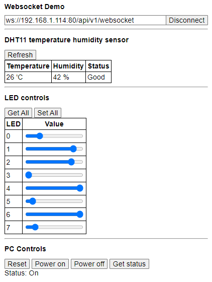

## Demo app using websockets
[](https://github.com/FiendChain/esp8266-websocket-demo/actions/workflows/linux_build.yml)

Basic ESP8266 sketch which serves a website and communicates over a websocket.

Refer to ```./scripts/README.md``` for setup instructions.


