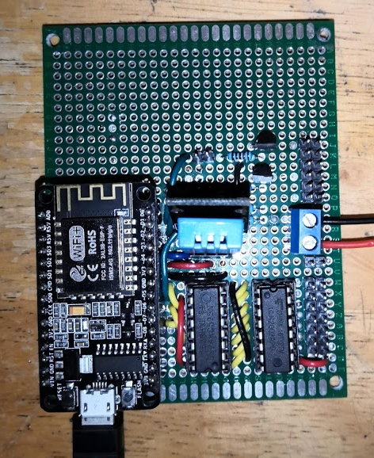
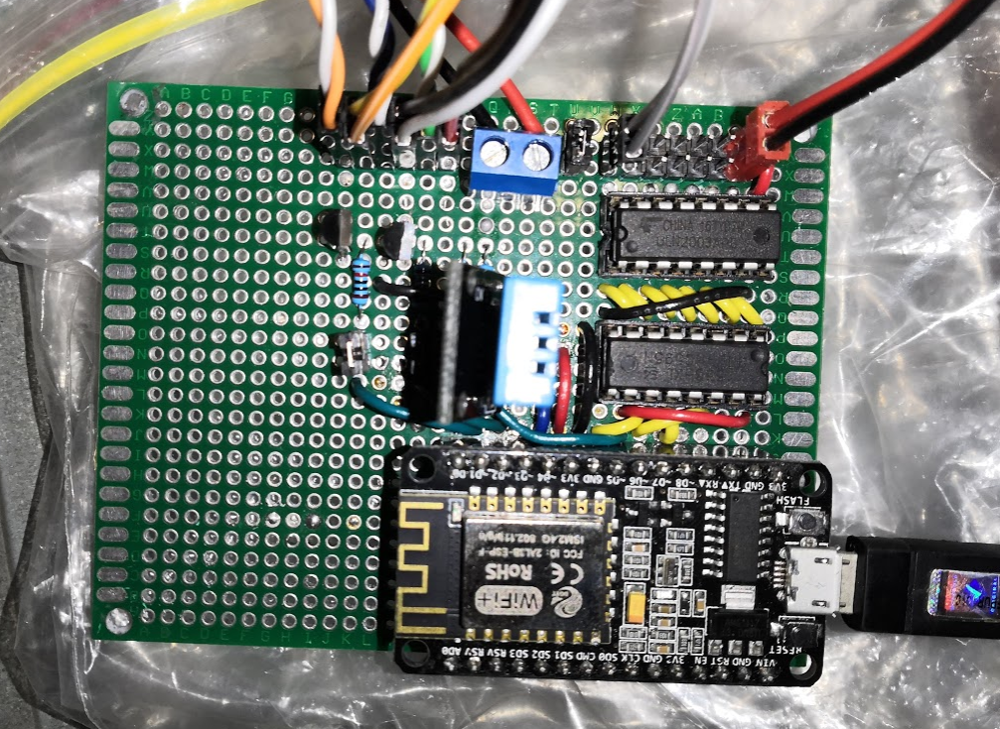

## Remote controller for PC
Able to remote boot and reset a computer by hooking into the motherboard front IO header pins.
Also features an 8 channel PWM array of open collector LED drivers for PC lighting.
Built off the RTOS SDK by Espressif for the ESP8266.  

Client for controlling this server can be [found here](https://github.com/FiendChain/ESP8266-RemoteAccess-UI).

### Completed
* Basic WiFi connectivity to local WLAN 
* Websocket implemented
    * Setting and getting of PWM channels
    * Controlling PC I/O for remote boot and reset
    * Getting PC power status
    * Getting temperature and humidity information
* Client software
  * Autoconnect to the server
  * Able to connect over local WLAN or remotely through a static ip (port forwarding)

## Gallery
### PCB 

### PCB installed inside test computer
Motherboard IO breakout is connected, as well as two led strips.

## TODO 
#### Micontroller
* Add button/jumper for user initialisation on pre-boot
  * Connect to access point to configure settings
  * Connect to serial port to configure settings
  * After restoring this button/jumper should execute user settings
    * Access point should be disabled after config
* Add user authentication for server
* Add support for OTA (over the air) updates
* Add power management software to reduce power consumption when idle
  * Intelligently disable PWM if it is doing nothing
  * Look into deep sleep in SDK

#### Desktop/Mobile app
* Use websockets
  * Provide corresponding user authentication details

#### Issues
* Encryption for secure access slows down ESP dramatically
  * Could implement proxy so that authentication is done between client and server
  * Would still be insecure over local network
