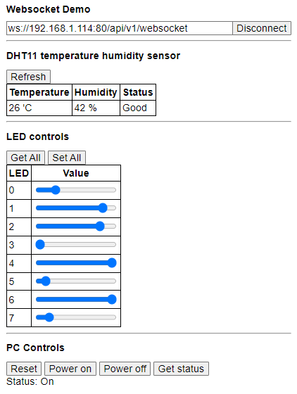

## Demo app using websockets
[](https://github.com/FiendChain/esp8266-websocket-demo/actions/workflows/linux_build.yml)

Basic ESP8266 sketch which serves a website and communicates over a websocket.
Port to work with remote pc controls project.
| Pin | Usage |
| --- | --- |
| GPIO0 | Power switch |
| GPIO2 | LED status |

Refer to ```./scripts/README.md``` for setup instructions.



## Porting to ESP-01
Modified to work with ESP-01.
- Partitions resized for 1MB flash storage.

| Partition | Old Size | New Size |
| --- | --- | --- |
| Factory | 1MB | 640kB |
| Storage | 1MB | 128kB |

- Flash command updated with resized partitions.
- Flash command uses ```DOUT``` instead of ```QIO``` for flash mode.
- ```sdkconfig``` updated with new flash storage size, flash mode, and minimum size binaries.
